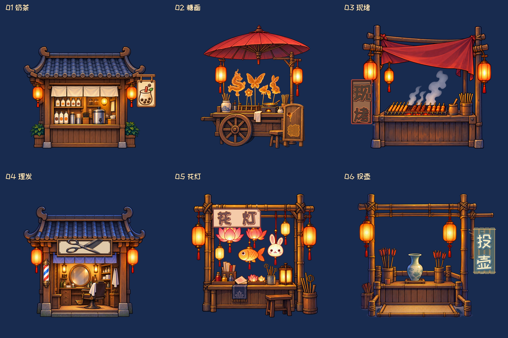
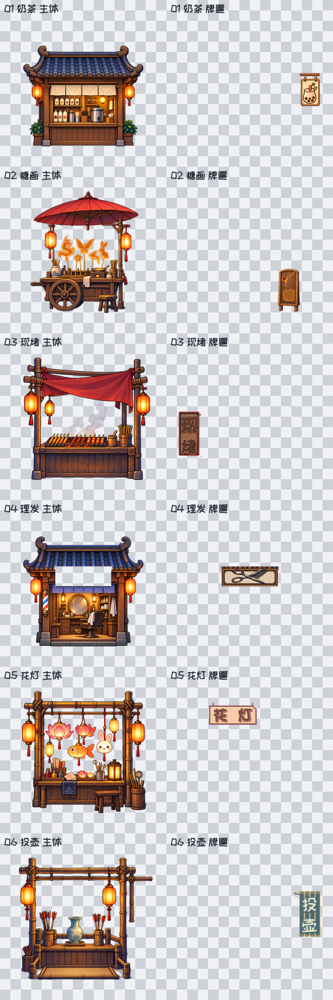

# U03 六店正式切片 v0.3：Gate2 用户审核包

**待审核版本：`U03-SHOP-FAITHFUL-REDRAW-V03 / r3-light-middle`。** 本版按您在三面板中指定的**中间店铺主体风格与明暗**制作，暗部仍保留木纹与物件可读性；已选六店身份、图案和牌位延续。01–04 只定向提升牌匾清晰度与字效，05/06 沿用原牌及店体。下方总览全部由本版实际 `body + sign` 切片按同画布、同尺度重组，旧深色 r1/r2 候选不在这张图中。

## 请看实际切片

下方棋盘底联系表展示 12 张正式 PNG 的真实透明对象，左列为主体，右列为牌匾。每店有一张 1024×1024 分层 PSD，源文件与逐件 SHA-256 见 [CUT_MANIFEST.json](CUT_MANIFEST.json)。

| 店铺 | 实际重组 | body PNG | sign PNG | PSD | 390 / 720 静态视窗 |
| --- | --- | --- | --- | --- | --- |
| 01 奶茶 | [查看](preview/light_r3_final/shop_01_recomposed.png) | [主体](exports/light_r3_final/tex_u03_shop_01_body_visual_fidelity_v03.png) | [杯叶小牌](exports/light_r3_final/tex_u03_shop_01_sign_visual_fidelity_v03.png) | [母版](psd/shop_01_visual_fidelity_v03.psd) | [390](preview/light_r3_final/shop_01_390x844.png) / [720](preview/light_r3_final/shop_01_720x1280.png) |
| 02 糖画 | [查看](preview/light_r3_final/shop_02_recomposed.png) | [主体](exports/light_r3_final/tex_u03_shop_02_body_visual_fidelity_v03.png) | [糖勺立牌](exports/light_r3_final/tex_u03_shop_02_sign_visual_fidelity_v03.png) | [母版](psd/shop_02_visual_fidelity_v03.psd) | [390](preview/light_r3_final/shop_02_390x844.png) / [720](preview/light_r3_final/shop_02_720x1280.png) |
| 03 现烤 | [查看](preview/light_r3_final/shop_03_recomposed.png) | [主体](exports/light_r3_final/tex_u03_shop_03_body_visual_fidelity_v03.png) | [现烤竖牌](exports/light_r3_final/tex_u03_shop_03_sign_visual_fidelity_v03.png) | [母版](psd/shop_03_visual_fidelity_v03.psd) | [390](preview/light_r3_final/shop_03_390x844.png) / [720](preview/light_r3_final/shop_03_720x1280.png) |
| 04 理发 | [查看](preview/light_r3_final/shop_04_recomposed.png) | [主体](exports/light_r3_final/tex_u03_shop_04_body_visual_fidelity_v03.png) | [剪梳横牌](exports/light_r3_final/tex_u03_shop_04_sign_visual_fidelity_v03.png) | [母版](psd/shop_04_visual_fidelity_v03.psd) | [390](preview/light_r3_final/shop_04_390x844.png) / [720](preview/light_r3_final/shop_04_720x1280.png) |
| 05 花灯 | [查看](preview/light_r3_final/shop_05_recomposed.png) | [主体](exports/light_r3_final/tex_u03_shop_05_body_visual_fidelity_v03.png) | [原花灯横牌](exports/light_r3_final/tex_u03_shop_05_sign_visual_fidelity_v03.png) | [母版](psd/shop_05_visual_fidelity_v03.psd) | [390](preview/light_r3_final/shop_05_390x844.png) / [720](preview/light_r3_final/shop_05_720x1280.png) |
| 06 投壶 | [查看](preview/light_r3_final/shop_06_recomposed.png) | [主体](exports/light_r3_final/tex_u03_shop_06_body_visual_fidelity_v03.png) | [原投壶竖牌](exports/light_r3_final/tex_u03_shop_06_sign_visual_fidelity_v03.png) | [母版](psd/shop_06_visual_fidelity_v03.psd) | [390](preview/light_r3_final/shop_06_390x844.png) / [720](preview/light_r3_final/shop_06_720x1280.png) |

## 本版具体变化

- **01**：保留所选中间店铺的完整主体与明暗，只换高清右檐下杯、珍珠、叶的小木牌。原牌位和占比不变。
- **02**：保留原糖画车与伞，车前仍是小立牌；木板、糖勺糖浆高清独立层，较小的“糖”复用原正式 PSD 字形。
- **03**：保留原烤架、竖牌、“烤”字，只校正新“现”字的粗圆主体、暖橙边和深棕字效。新字源来自已核 SIL OFL 1.1 的官方 ZCOOL KuaiLe；原“烤”像素不变。
- **04**：原理发店与横牌不动，独立图形换成可辨的剪刀双环、交叉刃和梳齿。
- **05–06**：原“花灯”“投壶”及各自 PSD、body、sign 均逐字节沿用。

本版经过 01 首样 Art 视觉与 Tech 文件后验，并由 Art 检查六店真实重组、390/720 视窗、PSD 图层与切片关系。逐件 SHA、alpha 边界、继承关系与差异范围见 [CUT_MANIFEST.json](CUT_MANIFEST.json)、[PSD_LAYER_EXPORT_MAP.md](PSD_LAYER_EXPORT_MAP.md)、[DIFF_AND_RECOMPOSITION_REPORT.json](DIFF_AND_RECOMPOSITION_REPORT.json)。新牌均为可编辑**栅格层**；生成源和遮挡背面限制已记录，不声称矢量或完全相同于概念图。当前是**切片版本 Gate2 待审核**；本 v0.3 新版切片尚未正式接入，Creator 对新版的实际场景、Web/设备画面和性能尚未验证。
