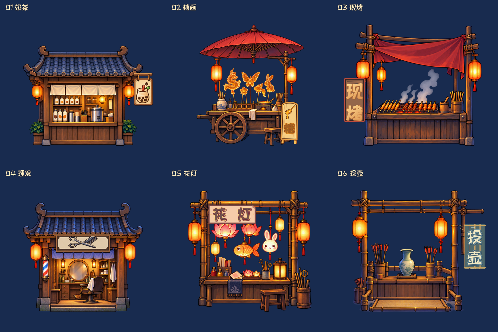
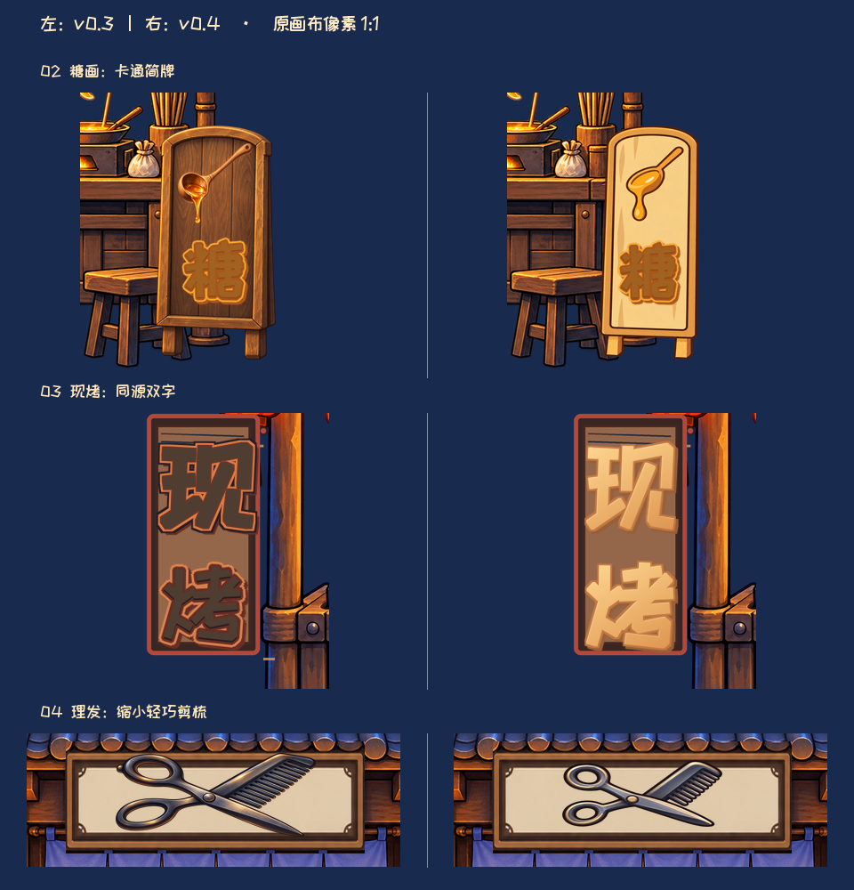
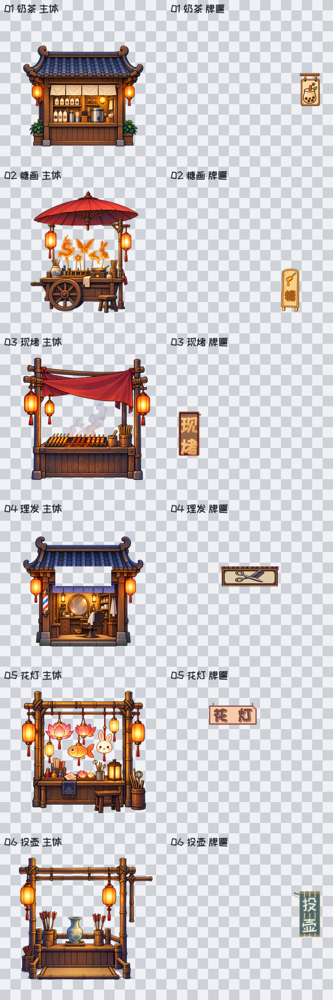

# U03 六店牌匾 v0.4｜Gate2 实片审核

**本次请审核 v0.4 实际六店资源。** 按您退回 v0.3 时指出的三处问题，只修改 02 糖画、03 现烤、04 理发的牌匾；六店主体及 01、05、06 的 PSD 和两张切片都与 v0.3 逐字节相同。店铺的整体明暗继续使用您已选的中间版。下图由本版 12 张真实 PNG 按同画布、同尺度重组。

## 三处牌匾原尺寸前后对照

下图左侧是 v0.3，右侧是 v0.4；各行都保留原 1024 画布的 **1:1 像素**，仅裁出牌匾附近供看细节，并未放大图案。02 换成浅暖木色简框及牌面绘制的卡通勺浆，正式小“糖”字保留；03 “现烤”两字由同一合法字体源重绘为统一暖金浅立体字；04 剪梳缩至约 80%，双环、交叉刃及梳齿仍清楚，牌框留白增加。

## 本版实际资源

下方棋盘底联系表展示 12 张真实 RGBA 切片：每行左侧为主体，右侧为牌匾。六店均为 1024×1024 画布、脚点 `(512,900)`，`body + sign` 在同原点叠合。逐件 SHA-256、透明边界及来源见 [CUT_MANIFEST.json](CUT_MANIFEST.json)，图层见 [PSD_LAYER_EXPORT_MAP.md](PSD_LAYER_EXPORT_MAP.md)。

| 店铺 | 实际重组 | 主体 PNG | 牌匾 PNG | PSD | 静态视窗 |
| --- | --- | --- | --- | --- | --- |
| 01 奶茶 | [查看](preview/sign_polish_v04_final/shop_01_recomposed.png) | [body](exports/sign_polish_v04_final/tex_u03_shop_01_body_sign_polish_v04.png) | [sign](exports/sign_polish_v04_final/tex_u03_shop_01_sign_sign_polish_v04.png) | [PSD](psd/shop_01_sign_polish_v04.psd) | [390](preview/sign_polish_v04_final/shop_01_390x844.png) / [720](preview/sign_polish_v04_final/shop_01_720x1280.png) |
| 02 糖画 | [查看](preview/sign_polish_v04_final/shop_02_recomposed.png) | [body](exports/sign_polish_v04_final/tex_u03_shop_02_body_sign_polish_v04.png) | [sign](exports/sign_polish_v04_final/tex_u03_shop_02_sign_sign_polish_v04.png) | [PSD](psd/shop_02_sign_polish_v04.psd) | [390](preview/sign_polish_v04_final/shop_02_390x844.png) / [720](preview/sign_polish_v04_final/shop_02_720x1280.png) |
| 03 现烤 | [查看](preview/sign_polish_v04_final/shop_03_recomposed.png) | [body](exports/sign_polish_v04_final/tex_u03_shop_03_body_sign_polish_v04.png) | [sign](exports/sign_polish_v04_final/tex_u03_shop_03_sign_sign_polish_v04.png) | [PSD](psd/shop_03_sign_polish_v04.psd) | [390](preview/sign_polish_v04_final/shop_03_390x844.png) / [720](preview/sign_polish_v04_final/shop_03_720x1280.png) |
| 04 理发 | [查看](preview/sign_polish_v04_final/shop_04_recomposed.png) | [body](exports/sign_polish_v04_final/tex_u03_shop_04_body_sign_polish_v04.png) | [sign](exports/sign_polish_v04_final/tex_u03_shop_04_sign_sign_polish_v04.png) | [PSD](psd/shop_04_sign_polish_v04.psd) | [390](preview/sign_polish_v04_final/shop_04_390x844.png) / [720](preview/sign_polish_v04_final/shop_04_720x1280.png) |
| 05 花灯 | [查看](preview/sign_polish_v04_final/shop_05_recomposed.png) | [body](exports/sign_polish_v04_final/tex_u03_shop_05_body_sign_polish_v04.png) | [sign](exports/sign_polish_v04_final/tex_u03_shop_05_sign_sign_polish_v04.png) | [PSD](psd/shop_05_sign_polish_v04.psd) | [390](preview/sign_polish_v04_final/shop_05_390x844.png) / [720](preview/sign_polish_v04_final/shop_05_720x1280.png) |
| 06 投壶 | [查看](preview/sign_polish_v04_final/shop_06_recomposed.png) | [body](exports/sign_polish_v04_final/tex_u03_shop_06_body_sign_polish_v04.png) | [sign](exports/sign_polish_v04_final/tex_u03_shop_06_sign_sign_polish_v04.png) | [PSD](psd/shop_06_sign_polish_v04.psd) | [390](preview/sign_polish_v04_final/shop_06_390x844.png) / [720](preview/sign_polish_v04_final/shop_06_720x1280.png) |

Art 已在同尺度总览与 390/720 静态视窗看过三处修订。文件核验为 **39/39 路径和 SHA 匹配**，六店新旧牌透明覆盖区域以外的重组差异为 0；详细结果见 [FINAL_PACKAGE_VALIDATION.json](FINAL_PACKAGE_VALIDATION.json)。PSD 为独立**栅格图层**，不是可任意缩放的矢量，来源、字体许可与可编辑范围已记录。本 v0.4 是待您 Gate2 审核的具体资源候选，**尚未正式接入客户端**；390/720 为静态视窗，Creator 中的真实运行画面及性能尚未验证。
