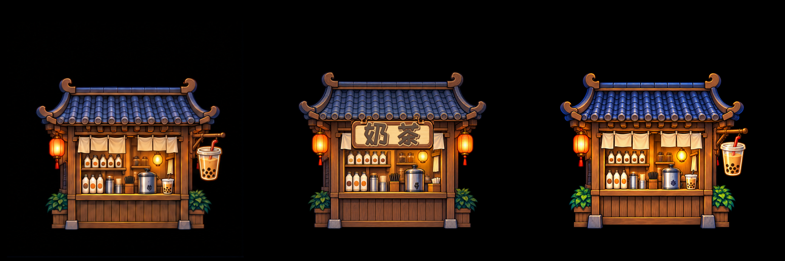

# 01 奶茶整店重绘样张｜Art 同尺度检查

**输入与方法。** 用户新参考 SHA-256 `B1295170D7245FA8BF4471FF29AFBA8A5C32BA4E5F59637814E87A793C85F8C9`；已接入旧版仅作对照。首张用内置 imagegen 对整店一次重新生成，透明原画在 `source/shop_01/imagegen_whole_r1.png`（1254×1254 RGBA，SHA-256 `FE31C8353F7C1160EEEF0CBC2AA33D6D5D447FDA4B8FD5607D1E0427F9D18A93`）。归一到 1024×1024、脚点 `(512,900)`，未借旧图层局部拼修；四层 PSD 为按画面区域粗分的可选择栅格层，背后遮挡未补绘，不宣称可任意重排。`body + sign` 可见像素重组与归一化新画一致。

| 锚点 | 结论 | 证据与差异 |
| --- | --- | --- |
| 店型轮廓、蓝瓦卷角、比例和脚点 | PASS | 同黑底三图对照；新屋顶/柜身关系与目标相近，1024 实图 bbox 和旧入库 bbox 对齐。 |
| 奶白短帘、瓶罐/茶锅、木柜及双暖光 | PASS | 整体物件身份和主次保持；新图帘片较参考略密、蓝瓦高光更亮且轮廓线更硬，390 视窗可见但未改变店型。此差异保留给成品用户看图判断，不宣称逐像素一致。 |
| 右檐悬挂珍珠奶茶杯、无横字牌 | PASS | 与新参考同为右侧杯形挂件；旧已接入版为中央“奶茶”横字牌。新杯和支架位置清楚。 |
| 透明边/黑底 | PASS | 新原画 RGBA alpha 0–255；正式 body/sign 片均真透明，黑色仅用于同背景比较，未写入切片。 |
| 分层与同原点两片重组 | PASS | `psd/shop_01_full_redraw_v01.psd` 1024×1024 四栅格层；`source/shop_01/psd_work/build_report.json` 和两 PNG；按掩模切层的语义边界较粗，不能用于自由动画。 |
| 390×844 / 720×1280 实际尺度静态预览 | PASS | `preview/shop_01_390x844.png`、`preview/shop_01_720x1280.png`；灯、杯、卷檐和主要经营物可辨。Creator 真机运行未验证。 |

**Art 判断：** 01 样张可作为本批完整重绘的视觉做法继续制作 02–06；蓝瓦高光/线条偏硬与帘片差异须在六店总览中再看统一性，最终交用户看具体图决定。本文只核 Art 静态实图，不代替 Tech 样张后验、六店成品 Gate2 或运行测试。
