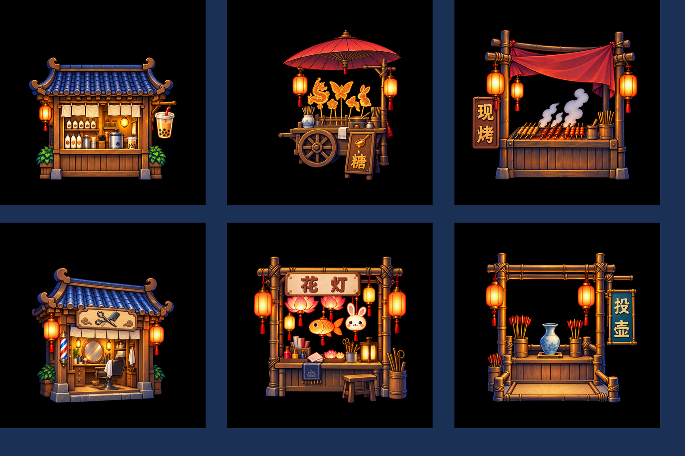
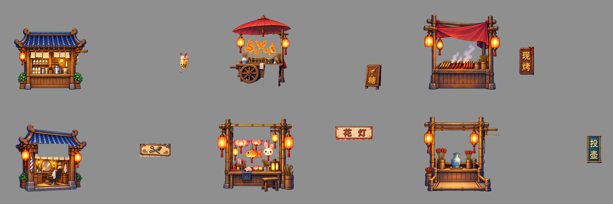

# U03 六店整体重绘 v0.1｜请先看图

按您本轮六店参考，六家店都已**整店重新绘制**；01 右挂奶茶杯、02 前倾“糖”木牌、03“现烤”、04 剪梳图牌、05“花灯”、06“投壶”。这批图尚未替换 U03，等您看过具体效果再决定。

每家新画有一份 [多层 PSD 和切片清单](CUT_MANIFEST.json)，共六 PSD、12 张 1024×1024 真透明 PNG；在相同脚点 `(512,900)` 叠合为上方总览。逐店“您给的参考｜当前已接入旧版｜本轮新图”同黑底同尺度对照，以及 `390×844` / `720×1280` 游戏视窗静态图：

| 店 | 三图对照 | 390 视窗 | 720 视窗 |
| --- | --- | --- | --- |
| 奶茶 | [01 对照](preview/shop_01_reference_old_new_same_scale_black.png) | [390](preview/shop_01_390x844.png) | [720](preview/shop_01_720x1280.png) |
| 糖画 | [02 对照](preview/shop_02_reference_old_new_same_scale_black.png) | [390](preview/shop_02_390x844.png) | [720](preview/shop_02_720x1280.png) |
| 现烤 | [03 对照](preview/shop_03_reference_old_new_same_scale_black.png) | [390](preview/shop_03_390x844.png) | [720](preview/shop_03_720x1280.png) |
| 理发 | [04 对照](preview/shop_04_reference_old_new_same_scale_black.png) | [390](preview/shop_04_390x844.png) | [720](preview/shop_04_720x1280.png) |
| 花灯 | [05 对照](preview/shop_05_reference_old_new_same_scale_black.png) | [390](preview/shop_05_390x844.png) | [720](preview/shop_05_720x1280.png) |
| 投壶 | [06 对照](preview/shop_06_reference_old_new_same_scale_black.png) | [390](preview/shop_06_390x844.png) | [720](preview/shop_06_720x1280.png) |

Art 已逐店核对店型、牌字/图形、经营物、灯光、透明边和视窗可读性。与参考相比，本批蓝瓦与竹木的高光/轮廓整体更亮更硬；04 理发屋透视略偏斜，05 花灯灯具更亮、略大；01 帘片更密。这些差异在同尺度图里可直接判断。PSD 是完整新画拆出的四个**栅格区域层**，可单独选层修像素，但遮挡背面没有补绘，`sign` 层可能含邻近店体像素；[图层范围](PSD_LAYER_EXPORT_MAP.md)已如实说明。中文“糖、现烤、花灯、投壶”已逐字看图核对。

本包是请您审具体 v0.1 图的 Gate2 候选。您确认前不会替换 U03 客户端资源；确认后仍需由 Client 导入并检查 Creator 中的真实运行画面和性能。静态图不等于运行验证。
