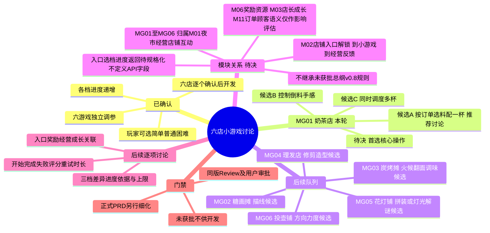

# 六店小游戏脑图可编辑源

版本 v0.1；讨论稿。MindMap AI 因额度不足未生成，使用 Mermaid 留存可编辑源。方括号内的“候选”均未获用户确认。

```mermaid
mindmap
  root((六店小游戏讨论))
    已确认
      六店逐个确认后开发
      玩家可选简单普通困难
      各档进度递增
      六游戏独立调参
    MG01 奶茶店 本轮
      候选A 按订单选料配一杯 推荐讨论
      候选B 控制倒料手感
      候选C 同时调度多杯
      待决 首选核心操作
    后续队列
      MG02 糖画摊 描线候选
      MG03 炭烤摊 火候翻面调味候选
      MG04 理发店 修剪造型候选
      MG05 花灯铺 拼装或灯光解谜候选
      MG06 投壶铺 方向力度候选
    模块关系 待决
      MG01至MG06 归属M01夜市经营店铺互动
      M02店铺入口解锁 到小游戏 到经营反馈
      M06奖励资源 M03店长成长 M11订单顾客语义仅作影响评估
      入口选档进度返回待规格化 不定义API字段
      不继承未获批总纲v0.8规则
    后续逐项讨论
      开始完成失败评分重试时长
      三档差异进度依据与上限
      入口奖励经营成长关联
    门禁
      同版Review及用户审批
      正式PRD另行细化
      未获批不供开发
```
