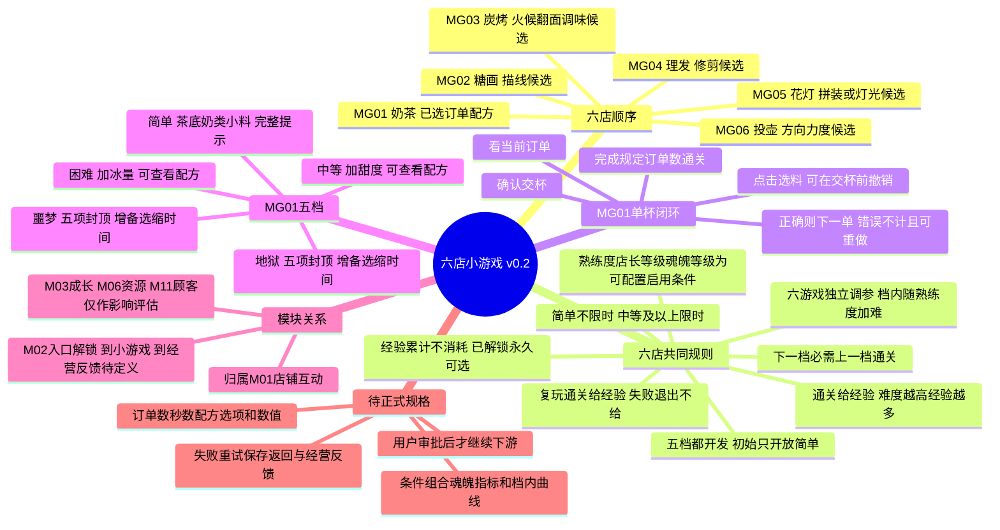

# 六店小游戏脑图可编辑源

版本 v0.2。MindMap AI 在 v0.1 创建时因额度不足未生成；本轮按已记录回退使用 Mermaid，未重新检测额度。此图与同版规则说明构成讨论 Artifact。

```mermaid
mindmap
  root((六店小游戏 v0.2))
    六店顺序
      MG01 奶茶 已选订单配方
      MG02 糖画 描线候选
      MG03 炭烤 火候翻面调味候选
      MG04 理发 修剪候选
      MG05 花灯 拼装或灯光候选
      MG06 投壶 方向力度候选
    六店共同规则
      五档都开发 初始只开放简单
      简单不限时 中等及以上限时
      六游戏独立调参 档内随熟练度加难
      通关给经验 难度越高经验越多
      复玩通关给经验 失败退出不给
      经验累计不消耗 已解锁永久可选
      下一档必需上一档通关
      熟练度店长等级魂魄等级为可配置启用条件
    MG01单杯闭环
      看当前订单
      点击选料 可在交杯前撤销
      确认交杯
      正确则下一单 错误不计且可重做
      完成规定订单数通关
    MG01五档
      简单 茶底奶类小料 完整提示
      中等 加甜度 可查看配方
      困难 加冰量 可查看配方
      地狱 五项封顶 增备选缩时间
      噩梦 五项封顶 增备选缩时间
    模块关系
      归属M01店铺互动
      M02入口解锁 到小游戏 到经营反馈待定义
      M03成长 M06资源 M11顾客仅作影响评估
    待正式规格
      订单数秒数配方选项和数值
      条件组合魂魄指标和档内曲线
      失败重试保存返回与经营反馈
      用户审批后才继续下游
```
