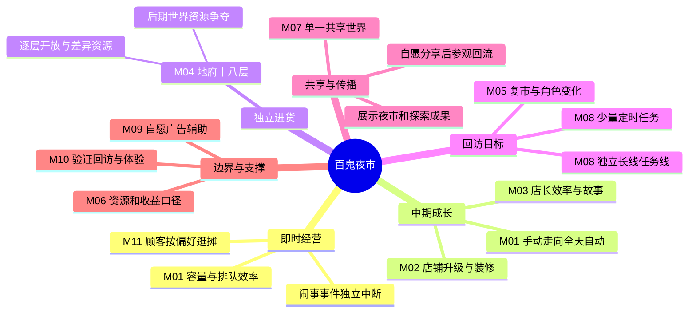

# 代号001｜概要脑图

版本：v0.6｜任务：PRODUCT-001｜成熟度：头脑风暴／待用户审批。

关键循环：顾客需求与排队效率 → 经营收益 → 店铺、店长与装修成长 → 新的顾客和故事；夜市提出货材需求 → 十八层探索 → 资源回流夜市 → 推进后续层级。少量定时任务和长线目标把已有玩法串联起来；分享展示成果，再把接收者引向参观和自己的经营。

**用户明确**：排队不会因久等让顾客反感离开；等待只影响整体收益最大化。定时任务只在12:00–13:30及20:00–24:00窗口触发，相邻触发至少1小时。中期目标为24小时含离线自动经营，早期手动收益较优，逐步可达纯自动收益更优。长线目标可按开市天数、累计收益等触发，间隔整体由短到长且非纯线性。

**待定／建议**：脑图中的分享形式、十八层具体探索方式、任务数量与错过处理、收益曲线、目标分支均需后续分析。闹事事件与排队等待是不同原因；后期世界资源争夺不应阻塞普通经营和基础成长。模块归属、历史来源及更多待决问题见同目录 `PRODUCT_OUTLINE.md`。
