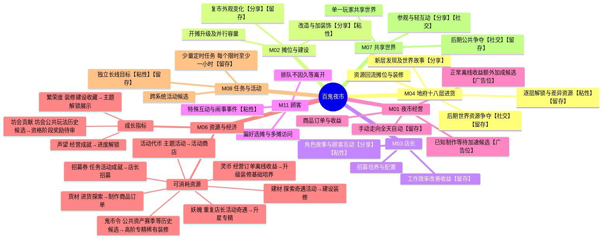

# 代号001｜系统玩法脑图源

版本：v0.7｜成熟度：头脑风暴／待审批。此文件为项目内可编辑源；[MindMap AI交互图](https://mindmapai.app/canvas/c600834c508250f6f306a774bf7026543a7d7aa3447072ead057524cca48b0b8/edit)及同目录 `MINDMAP_AI_SNAPSHOT.md` 为同版展示产物。

**关键闭环**：M04进货的货材／建材 → M01制作售卖与M02摊位建设 → 收益、顾客变化及复市 → 继续探索；M03店长效率与M11顾客偏好改变经营选择。M06统一资源身份和来源用途，M08组织回访目标，M07展示成果并承接后期公共资源。

【分享】【社交】【粘性】【广告位】【留存】是具体节点的分析标签，**不是独立玩法或已批准投放点**。M05故事嵌入十八层、店长和复市节点；M09自愿广告仅标在M01候选入口，M10体验验证属于观察支撑，未列为玩法主枝。资源来源用途按历史S2摘要，弱社交下坊会门槛需重审；具体规则与正式状态见同版 `PRODUCT_OUTLINE.md`。

用户明确两个定时触发窗口为12:00–13:30、20:00–24:00，每个任务限时时长至少1小时；图省略窗口细节。排队久等不造成顾客离开，后期世界争夺不应阻塞普通经营与基础成长。
