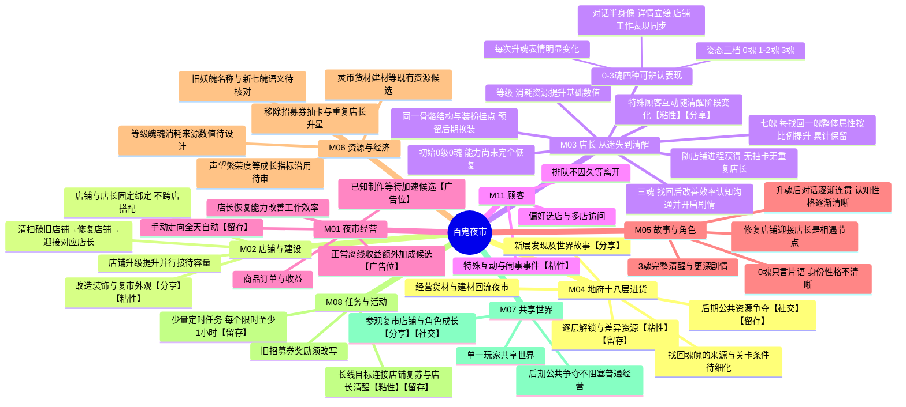

# 代号001｜系统玩法脑图源

版本：v0.8｜状态：头脑风暴修订，待用户审批。交互图：[MindMap AI v0.8](https://mindmapai.app/canvas/ca3de2ca0bd9198b95d4c3b88ed23be70c4ace16febc0e03d0dd67e08e14b467/edit)；同版导出见 `MINDMAP_AI_SNAPSHOT.md`。本版替代 v0.7 的店长招募与跨店配置方向，不改变其他模块尚待审批的状态。

**关键闭环**：清扫并修复店铺 → 迎接绑定店长 → 经营、探索与培养 → 找回三魂七魄 → 店长能力、认知、沟通和工作表现逐步恢复 → 开启角色剧情与新的经营目标。魄带来整体属性比例成长；魂影响工作效率与故事。等级、魄、魂的门槛和消耗待数值设计。

**版本边界**：三魂七魄表示最终完整状态。已找回的魄累计保留，旧示例“0魂7魄→1魂0魄”不再作为恢复进度显示规则；如果仍需阶段段位写法，必须另行定义，不得让玩家误以为已找回的魄消失。0、1、2、3魂各有可辨认表现，姿态按0／1–2／3三档，保持骨骼结构与装扮挂点一致。半身像、立绘和场景工作表现都要体现阶段；具体美术制作和技术实现仍待对应专业规格与评审。

【分享】【社交】【粘性】【广告位】【留存】只是节点分析标签，不代表已批准功能或投放点。其他系统仍为概要候选；用户批准本版前不得作为下游开发输入。
