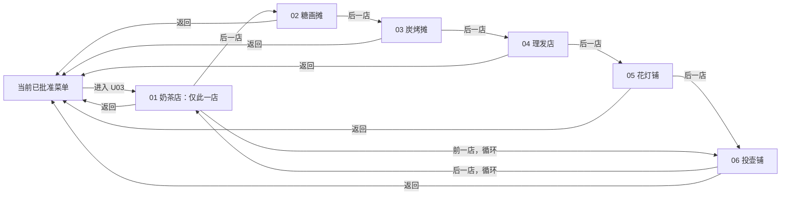

# U03 店铺示例｜操作与状态流程 v0.1

六项都允许按相反顺序前一店切换。UI 可提出等效的六项直接选择控件；若采用该形式，必须保留“单一当前店、全项可达、返回再进入为 01”的状态语义。图中的菜单只表示进入/返回锚点：现行已批准内容是唯一 U01，U02 处于独立审批中，U03 加入时按当时有效的批准版本组成菜单。

每次切换同时更新店铺画面、牌匾和当前身份文字；旧状态整体退出后才呈现新状态，不允许另一店铺残留。快速连续操作以最后一次有效选择为当前店，不累计或并列店铺。返回销毁/退出 U03 展示状态；再次进入重建 01 奶茶店。没有经营、装修、解锁或持久化分支。
