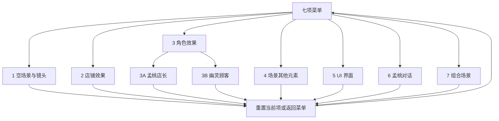

# 七项菜单单元样例｜操作与状态流程 v0.1

任务：`UNIT-MENU-PRODUCT-001`。本流程描述玩家/审阅者在**演示菜单**中的操作，不定义主体游戏的玩法控制。

## 1. 总入口

公共动作：进入某项→显示其初始状态与可操作控制→操作并观察→重置当前项或返回。返回时终止当前项的动作、特效、对话浮层和临时对象；再进入不继承前一项状态。第 3 项的两个子入口各自独立初始化。

## 2. 各项主要流程

| 项 | 初始 | 用户操作 | 预期状态迁移 | 退出/重置 |
|---|---|---|---|---|
| 1 | 仅固定背景，初始镜头 | 左右拖拽、放大、缩小 | 视野水平移动或倍率变化，受合法边界限制 | 恢复初始镜头；无对象需清理 |
| 2 | 奶茶店常态 | 启动一次动态/光影预览 | 常态→动效/光影→常态，可再次触发 | 停止动效和光影变化，回常态 |
| 3A | 孟桃骨骼待机 | 启动工作表现 | 待机→一次工作动作/反馈→待机 | 停止当次动作/反馈并恢复待机 |
| 3B | 一名顾客待机，左右朝向初值清楚标示 | 选择左/右；选择移动/跑动/高兴/沮丧/坐姿 | 朝向与状态双轴生效；单源骨骼水平翻转，旧动作干净退出；坐姿与独立板凳对位 | 离座/停止位移，顾客回初始朝向与状态 |
| 4 | 树、花、灯笼各有开关状态 | 分别开关及预览 | 仅目标对象及附属特效增减 | 所有开关恢复初始设置、特效不残留 |
| 5 | 共用身份组件状态样张 | 查看所需状态和布局 | 仅 UI 状态变化，不启动经营 | 回初始 UI 状态 |
| 6 | 对话关闭 | 打开孟桃示例对话、继续/关闭 | 关闭→展示示例文字→关闭 | 清空演示进度，不保留主线标记 |
| 7 | 与第 1 项同一空背景和初始镜头 | 分别添加/移除店、孟桃、顾客、板凳、树/花/灯笼；移动测试对象位置；可选预览 UI/对话及动作 | 只对所选对象增减；遮挡随对象位置/状态变化；与前几项同源 | 清掉全部可切换对象及其特效，恢复空场景和初始镜头 |

## 3. 冲突与异常流程

| 情况 | 产品可见处理原则 |
|---|---|
| 正在工作动作或店铺动效时再次触发 | 不生成第二套叠加表现；界面给出明确执行/忙碌状态或可预测的重启动作，具体策略由 Tech/Client 审批并保持两入口一致 |
| 顾客快速交替切换动作和方向 | 最终可见状态与最后一次有效选择一致；旧位移、表情和动作结束，不重影、不丢方向 |
| 顾客坐姿时移除板凳 | 顾客安全离座或切到不依赖板凳的状态；不能悬空坐着 |
| 第 7 项先添加孟桃后添加店铺，或先移除店铺 | 对象独立存在；身份关联 UI 仅在内容真实时呈现，不把缺席对象写成正在画面内 |
| 隐藏灯笼/树/花时其特效仍在播放 | 对象和附属特效同步退出；再次显示从可预测状态开始 |
| 镜头拖拽/缩放碰到内容边界 | 停在合法视野，不露出空白或未制作区域；缩放后仍可重置 |
| 对话浮层打开时操作场景 | 对话交互优先，避免误拖/误触；关闭后恢复原场景可操作状态 |
| 某正式资产、方向或字体许可缺失 | 标示当前项不可作为正式验收，不用旧 Demo 或占位内容伪装完成 |

以上具体手势、动画中断规则和坐标边界由对应专业规格确定，Product 验收依据 [ACCEPTANCE.md](ACCEPTANCE.md) 的外显结果。
