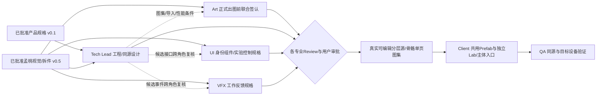

# 孟桃奶茶店单元｜概念获批后的专业并行与依赖

日期：2026-10-02。用户在看到 `UNIT-PILOT-ART-CONCEPT-001 v0.5` 的三张图与拆件方案后明确要求“好的继续把”；Producer已将此具体版本登记为 `USER_APPROVED`。最小产品规格 `UNIT-PILOT-PRODUCT-001 v0.1` 也已批准。本图只组织当前项目内的后续输入与门禁，不增加经营规则。

| 本轮正式任务 | Owner | 具体待审产物 | 当前实施边界 |
|---|---|---|---|
| `UNIT-PILOT-TECH-DESIGN-001` | Tech Lead | Creator工程形态、共享接口、骨骼导入/性能方案及旧工程迁移评审 | 不修改客户端代码、不单方修改跨角色契约 |
| `UNIT-PILOT-ART-SOURCE-PREFLIGHT-001` | Art + Tech Lead联合 | 分层制作清单、骨骼附件包围盒与单页草排签认 | 正式图片输出前审查，不能把概念PNG叫作分层源 |
| `UNIT-PILOT-UI-SPEC-001` | UI，Art审视觉 | 共用身份组件、状态与Lab专用控制线框 | 不新增商品/价格/收益界面，字体许可另核 |
| `UNIT-PILOT-VFX-SPEC-001` | VFX，Art审视觉 | 一次工作表现的触发/时序/清理和轻量反馈 | 不表达奖励、订单或养成 |

四任务各自依据Task Packet列出Required Artifacts；专业Review后的具体版本分别进入`USER_REVIEW`。各任务只正式消费已批准的Product与Art v0.5，上图虚线表示同期候选接口复核，不能把Tech未批准草案当成UI/VFX正式输入。正式可编辑分层源、骨骼数据、atlas与Creator单元实现尚未取得这轮审批，需在获批设计后分别进入生产、Client开工包与QA门禁。单元和主体应使用同一资产、状态/逻辑、公共UI与VFX版本；演示控制限Lab。旅客四方向是另单元要求，孟桃与店身按实际使用单视角。
